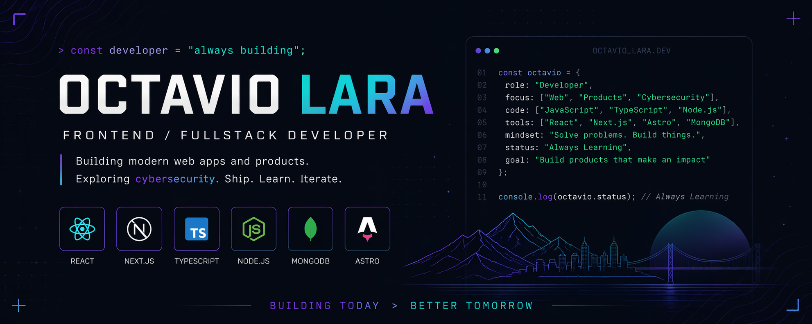

# 👋, I'm Octavio Lara

Frontend focused software developer with 3+ years working in tech and 5 years programming in total

---

## Projects

### Swift Learning
> [Repository](https://github.com/olaracode/swift-ui#readme.md)

While I learnt the basics of swiftui I developed a series of smaller projects, each exploring a different topic on my learning, ranging from basic rendering of components to a full crud application with authentication and notifications.

### Rust Learning

I dwelled a bit on Rust development for a short period of time, while I learn some cool things I wouldn't consider myself a "rustacean"

**Repositories**

- [Minigrep:](https://github.com/olaracode/rust-minigrep) Learning project that simulated a lite version of `grep` basically
- [Rust Basics:](https://github.com/olaracode/basic-rust) My learning repository, where I went over data types and general concepts of the Rust Language with examples
- [Basic Markdown Editor:](https://github.com/olaracode/md-editor) A basic desktop markdown editor built using Svelte + Tauri
- [Reel To Comment:](https://github.com/olaracode/reel-to-comment) Comments generator that takes in an instagram posts data and generates comments based on this, which after get sent to telegram

### Ruby

My only experience with Ruby was using Rails for a job evaluation where I had to build an application

**Repositories**

- [Quake:](https://github.com/olaracode/quake) Fullstack application that fetches the data of the latest earthquakes and renders it, contains a map visualization(not 100% accurate)
- [React On Rails:](https://github.com/olaracode/react-on-rails) Small template I created with a dockerized React + RoR application

### Javascript + Typescript

I've been working on javascript for over three years, so most of my projects are small practice projects targetted at a certain small part of the stack I'm looking to improve/experiment with

**Repositories**

- [Preset-X](https://github.com/olaracode/preset-x) Svelte Website that uses an LLM api to generate Preset Banks for my guitar pedalboard
- [Task System](https://github.com/olaracode/nextjs-task-system) **Technical Evaluation** Next.js Application that works as a task management | Tracking system, 
- [React + Apollo](https://github.com/olaracode/rick-and-morty) **Technical Evaluation**: React application that fetches data from the rick and morty GraphQL API
- [json-to-cv](https://github.com/olaracode/json-to-cv): Personal application I use to generate my cv based on a `json` file
